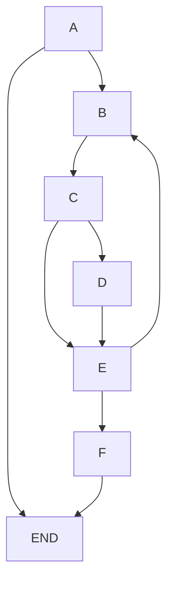
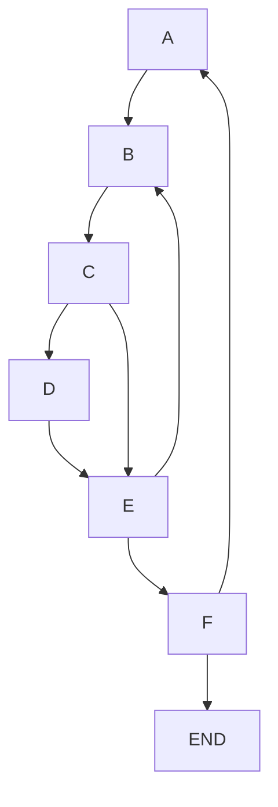

# Página - Hospital Top Top Top

## Descripción:

Propuesta de página web para el **"Hospital Top Top Top"**. En esta nueva versión se integró `JavaScript` para mejorar la interacción con el usuario y gestionar mejor la información del equipo médico. El sitio consta de 3 vistas:

- **Inicio**: Muestra mensaje de bienvenida, información general y testimonio de pacientes.
- **Equipo Medico**: Muestra información sobre el compromiso de atencion a los pacientes y sobre el equipo médico. Tiene un chekbox para filtrar a los médicos que atiende por fonasa.
- **Contacto**: Contiene un formulario de contacto para comunicarse con el hospital.

En todas las pantallas Hay un boton para agendar Hora, el cual solicita datos mediante prompts.

## Instrucciones:

1. Descargar el contenido de este repositorio en el computador. Puede ser clonando el repositorio o descargando el .zip:

   - **Clonar el repositorio**: Puede hacerlo con cualquier gestor de repositorios. Si tiene git instalado, puede abrir una terminal en algun diretorio y ejecutar:

   ```bash
   git clone url_de_este_repo
   ```

   - Si no tiene git instalado puede presionar el botón verde `<> Code` que está en esta página y seleccionar la opción `Download ZIP`.
     1. Descargue el archivo .zip en algun directorio conocido _(ej: Escritorio, Documentos, etc.)_.
     2. Descomprima el archivo .zip

2. Dentro de la carpeta, abrir el archivo `index.html` con su navegador de preferencia.

## Estructura de carpetas y archivos

- Los archivos .html estan en la raíz del directorio.
- En el directiorio `assets` se encuentran archivos multimedia y de estilos utilizados en el sitio.
  - `./assets/img` contiene las imágenes utilizadas en el sitio.
  - `./assets/css` contiene los archivos de estilo (Usando archivos sass).
  - `./lib/*` Contiene librerías utilizadas (En este caso solo Bootstrap).
  - `./scripts/` Contiene scripts de JS y archivos .json.

## Algoritmos

En el archivo [doctorsLoad.js](/scripts/doctorLoad.js) se encuentran los algoritmos de búsqueda y de ordenamiento para la lista de doctores. Para buscar doctores se aplica un algoritmo de **búsqueda lineal** y la ordenar los doctores se aplica el algoritmo de **Ordenamiento por selección**

### Algoritmo de busqueda lineal

Para buscar un `valor` en una lista de tamaño `n`, se recorre la lista desde el primer elemento, comparando el valor de cada elemento de la lista con el `valor` buscado.

En este algoritmo, los peores resultados son:

- Que el valor buscado se encuentre en el último elemento de la lista y por lo tanto se hacen `n` iteraciones.
- Que el valor buscado no se encuentre en la lista y por lo tanto, tambien se hacen `n` iteraciones.

Este algoritmo tiene una complejidad de cómputo de **O(n)**

#### Algorimto en JS

```js
const search = prompt('Ingrese nombre o especialidad').trim().toLowerCase();

// Nodo A: Se verifica que el usuario haya ingreado algo
if (search !== '' || search !== null) {
  doctors = await loadDoctors();
  const filteredDoctor = [];

  // Nodo B: Se reccorre un bucle del tamaño de la lista
  doctors.forEach((doctor) => {
    // Nodo C: Se verifica si existe el valor buscado
    if (
      doctor.name.toLowerCase().includes(search) ||
      doctor.job.toLowerCase().includes(search)
    ) {
      // Nodo D: Se añade el doctor a lista si el valor existe.
      filteredDoctor.push(doctor);
    }

    // Nodo E: Fin del ciclo del nodo B
  });

  // Nodo F: Se actualiza lista de doctores
  doctors = filteredDoctor;
}
// Hacer algo con la lista actualizada;
```

#### Grafo que representa el algoritmo



El grafo tiene 9 aristas (E) y 7 nodos (N). Aplicando la fórmula **V(g) = E - N + 2**, la complejidad ciclómática ( V(g) ) de este algoritmo es:

**V(g) = 9 - 7 + 2**

**V(g) = 4**

Al ser menor de 10, se considera un código bien estructurado.

### Algoritmo de Ordenamiento por Selección

Es uno de los algoritmos de ordenamiento sencillo de aplicar. Este método requiere la aplicación de 2 ciclos que recorren la lista, un ciclo servirá para retner el mayor o menor valor en la posición deseada (pivote), mientras que el otro comparará este valor con el resto de elementos de la lista.

Si se quiere realizar un ordenamiento descendente:

1. El pivote contiene el valor del elemento de la primera posición de la lista.
2. Se hace una comparación del pivote con todos los elementos siguientes de la lista.
3. Si existe un elemento con un valor mayor al pivote, se intercambian los valores del pivote y el elemento encontrado.
4. Cuando se hacen todas las comparaciones posibles con el pivote, el pivote pasa a la siguiente posicion y se repiten los pasos 2 ~ 3 hasta ordenar la lista

En una gran cantidad de datos desordenados, la lista se recorre aproximandamente `n * n` veces, por lo que la complejidad es **O(n²)**.

#### Algoritmo en JS

```js
// Nodo A: Ciclo for del pivote
for (let i = 0; i < doctors.length - 1; i++) {
  // Nodo B: Ciclo for del comparador
  for (let j = i + 1; j < doctors.length; j++) {
    // Nodo C: Comparador de años de servicio
    if (doctors[i].years < doctors[j].years) {
      // Nodo D: Intercambio si un doctor tiene más años de servicio
      [doctors[j], doctors[i]] = [doctors[i], doctors[j]];
    }
    // Nodo E: Fin del ciclo del comparador
  }
  // Nodo F: Fin del ciclo del pivote
}
// END: Fin del algoritmo
```

#### Grafo que representa el algoritmo



El grafo tiene 9 aristas (E) y 7 nodos (N). Aplicando la fórmula **V(g) = E - N + 2**, la complejidad ciclómática ( V(g) ) de este algoritmo es:

**V(g) = 9 - 7 + 2**

**V(g) = 4**

Al ser menor de 10, se considera un código bien estructurado.

## TO-DO (Rúbrica)

- [x] **Manejo de Objetos JSON:** Se implementa correctamente un objeto JSON con los datos de los doctores, incluyendo objetos anidados y uso de destructuring. La información se muestra correctamente en la consola y en la interfaz web.
- [x] **Operaciones con JSON:** Las operaciones de clonación, merge, y recorrido se implementan correctamente. La conversión a JSON string con stringify se muestra en la consola.
- [ ] **Implementación de Estructuras de Datos:** Se implementan correctamente las estructuras de datos solicitadas (arreglos, pilas y colas) y se realizan operaciones básicas como agregar, eliminar o buscar datos en los arreglos. Las pilas y colas gestionan correctamente los datos de citas o pacientes.
- [x] **Programación de Algoritmos:** Se implementa correctamente un algoritmo de búsqueda y uno de ordenamiento, explicando en el README la complejidad de los algoritmos aplicados (Big-O y complejidad ciclomática).
